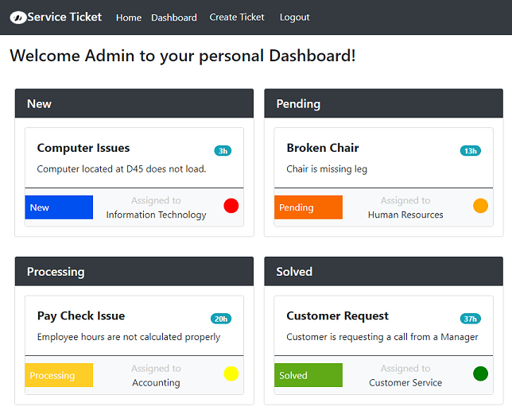

# Service Ticket Generator

## Description
Allow a user to create a ticket to deal with an issue. Have the issue have its own unique list item number that the user can view the status of the issue.
## Table Of Contents
* [Installation](#installation)
* [Usage](#Usage)
* [Credits](#Credits)
* [Contributing](#Contributing)
* [Questions](#Questions)
* [License](#license)
## Screenshot

## Installation
Deployed at https://service-ticket-manager.herokuapp.com/
## License
This is Licensed under the None license
## Usage
Create a number organized ticket system with color cordinated status that allows a user so know where the issues status is at. Also allow a team to organize there workflow simillar to a scrum board.
## Credits
Matt Damron, Russ Tracy, Bo Daley
## Contributing
Sorry no other contributors.
## Questions
https://github.com/matthewdamron, https://github.com/RussTracy,
https://github.com/6bodaley6
